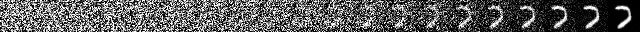

## Denoising Diffusion Probabilistic Models

A DDPM implemented by PyTorch for image generation task.

## Experiments

I have trained the model on MNIST dataset. The model converged well on the dataset, producing realistic samples. Here is a sample of  a diffusion sequence on MNIST;

 

## Reference

https://github.com/abarankab/DDPM

https://github.com/hojonathanho/diffusion

https://github.com/huggingface/diffusers

https://github.com/labmlai/annotated_deep_learning_paper_implementations

